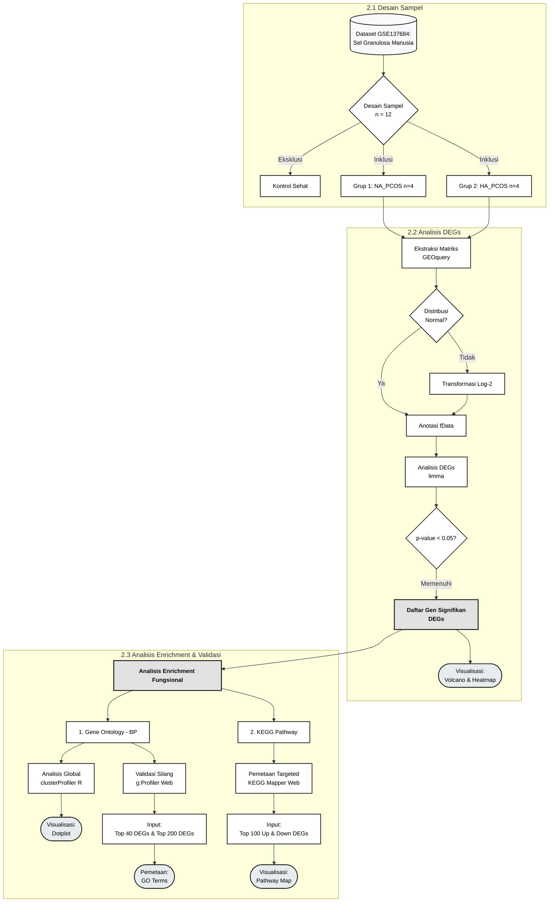
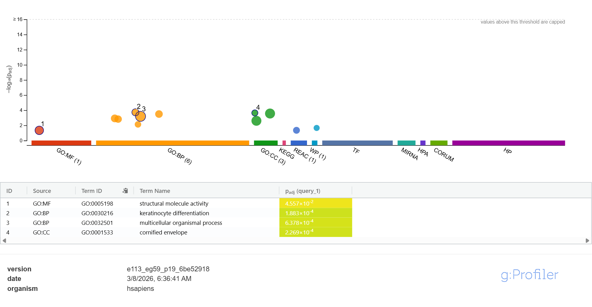

# Analisis Transkriptomik: Perbandingan Profil Genetik Sel Granulosa pada Subtipe Normoandrogenic (NA) dan Hyperandrogenic (HA) PCOS

### 1. Latar Belakang
*Polycystic Ovary Syndrome* (PCOS) merupakan salah satu gangguan reproduksi yang paling umum. Secara klinis, PCOS terbagi menjadi dua subtipe utama berdasarkan kadar testosteron: *Normoandrogenic* (NA) dan *Hyperandrogenic* (HA) yang identik dengan gejala hirsutisme, obesitas, dan resistensi insulin (Escobar-Morreale, 2018). Meskipun perbedaan klinisnya terlihat jelas, profil ekspresi genetik yang membedakan kedua subtipe ini di tingkat seluler belum sepenuhnya dipetakan. Analisis komparatif ini bertujuan untuk mengidentifikasi *Differentially Expressed Genes* (DEGs) secara komputasional guna mengungkap mekanisme molekuler spesifik yang membedakan sel granulosa pada subtipe HA dan NA PCOS (Kaur et al., 2012).

### 2. Metodologi Analisis

**2.1. Sumber Dataset dan Desain Pengelompokan Sampel**
Analisis transkriptomik ini menggunakan dataset microarray publik yang diunduh dari basis data Gene Expression Omnibus (NCBI GEO) dengan nomor aksesi GSE137684 (Kaur et al., 2012). Sampel jaringan utama yang diekstraksi dan dianalisis profil ekspresinya adalah sel granulosa manusia. Berdasarkan metadata keseluruhan desain dari dataset GSE137684, terdapat 12 subjek utama yang dibagi ke dalam tiga kelompok (masing-masing n = 4). Untuk menjawab tujuan spesifik dari analisis komparatif ini, sampel kontrol (individu sehat) dieksklusi dari matriks desain. Analisis direduksi menjadi perbandingan pairwise secara langsung antara dua kondisi patologis, yaitu Group 1: Pasien Normoandrogenic PCOS (NA_PCOS), dan Group 2: Pasien Hyperandrogenic PCOS (HA_PCOS).

**2.2. Pra-pemrosesan Data dan Analisis Differentially Expressed Genes (DEGs)**
Data matriks ekspresi mentah diekstraksi menggunakan package GEOquery pada perangkat lunak R. Pemeriksaan distribusi data dilakukan, dan transformasi Log-2 diterapkan untuk menstabilkan varians. Analisis DEG dieksekusi menggunakan package limma (Linear Models for Microarray Data) (Ritchie et al., 2015). Kriteria signifikansi gen ditetapkan berdasarkan ambang batas statistik p-value < 0.05. Visualisasi global dari DEGs dilakukan menggunakan Volcano Plot dan Heatmap untuk menampilkan pola ekspresi dari 50 gen teratas (Top 50 DEGs). Anotasi ID Probe menjadi Gene Symbol menggunakan data bawaan dari platform microarray terkait.

**2.3. Analisis Pengayaan (Gene Ontology & KEGG Pathway)**
Untuk menginterpretasikan signifikansi biologis dari daftar DEGs yang diperoleh, analisis pengayaan dilakukan menggunakan package clusterProfiler dan basis data anotasi manusia org.Hs.eg.db (Yu et al., 2012). Gene Ontology (GO) digunakan untuk memetakan gen yang signifikan secara statistik ke dalam kategori Biological Process (BP) untuk memahami jalur fungsi biologis apa saja yang terdampak. KEGG Pathway digunakan untuk memetakan DEGs ke dalam jalur persinyalan penyakit dan metabolisme tingkat sistemik. Visualisasi dari hasil analisis ini ditampilkan menggunakan Dotplot untuk membedakan jalur dengan rasio gen terdampak yang paling tinggi.

***

### 3. Hasil dan Interpretasi Biologis

**3.1. Evaluasi Kualitas Data (Boxplot)**

*Gambar 1. Distribusi nilai median ekspresi antar-sampel yang telah dinormalisasi.*

Berdasarkan visualisasi Boxplot pada Gambar 1, nilai median intensitas ekspresi (Log2) pada seluruh sampel berada pada garis ekuilibrium yang sejajar. Kesejajaran ini membuktikan bahwa tahap pemrosesan pra-analitik berjalan secara optimal, mengeliminasi varian teknis yang tidak diinginkan sehingga data valid untuk dibandingkan.

**3.2. Asimetri Transkripsional Global (Volcano Plot)**

*Gambar 2. Volcano plot mendemonstrasikan perombakan transkripsional yang masif pada subtipe HA.*

Analisis *differential expression* yang dipetakan melalui Volcano Plot (Gambar 2) mengungkap perombakan transkripsional yang ekstrem. Ditemukan sebanyak 1.866 gen (DEGs) yang terekspresi secara diferensial secara signifikan. Tingginya angka disregulasi genetik ini membuktikan bahwa HA dan NA memiliki dasar patofisiologi tingkat seluler yang sangat berbeda, di mana sel granulosa pada lingkungan *hyperandrogenic* bereaksi dengan hiperaktivitas kompensatorik yang tidak wajar (Zhao et al., 2021).

**3.3. Pemisahan Identitas Molekuler (Heatmap)**

*Gambar 3. Heatmap dari Top 50 DEGs memperlihatkan segregasi klaster yang sempurna antar subtipe.*

Klasterisasi hierarkis pada Gambar 3 memberikan validasi spasial yang tajam. Empat sampel dari penderita HA membentuk kelompok pola ekspresi genetik yang sangat seragam dan benar-benar bertolak belakang dengan kelompok NA. Hal ini menegaskan eksistensi *molecular signature* spesifik pada masing-masing kondisi patologis.

**3.4. Pemetaan Fungsi Biologis Translasi (Gene Ontology)**

*Gambar 4. Analisis pengayaan mengungkap aktivasi jalur kesehatan kulit dan supresi fungsi reproduksi.*

Analisis Gene Ontology (Biological Process) pada Gambar 4 sukses menerjemahkan data komputasional ke dalam realitas klinis pasien. Terdapat jalur perkembangan Jaringan Kulit (*Skin Development*) yang memvalidasi manifestasi fisik di dunia nyata. Hiperaktivasi konstelasi gen epitelial ini merupakan mekanisme seluler yang menjadi cikal bakal parahnya gejala hirsutisme dan jerawat membandel pada penderita HA PCOS (Azziz et al., 2016). Hasil juga menunjukkan adanya Supresi Reproduksi (*Negative Regulation of Reproductive Process*) sebagai bukti patofisiologi molekuler secara gamblang. Kerusakan transkripsional pada subtipe HA secara langsung mematikan mekanisme pematangan oosit, mendasari kegagalan ovulasi yang persisten (Welt et al., 2005).

**3.5. Validasi Silang Fungsional: Analisis Sinyal Ekstrem vs. Sistemik (g:Profiler)**
Untuk memvalidasi pergeseran global dari ribuan gen sebelumnya, analisis pengayaan fungsional sekunder dilakukan menggunakan basis data g:Profiler (Raudvere et al., 2019) dengan dua pendekatan ambang batas untuk melihat efek penyakit dari dua sudut pandang berbeda: Top 40 DEGs dan Top 200 DEGs.

*Gambar 5. Analisis pengayaan Top 40 mengungkap pemetaaan gejala fisik.*

**A. Sinyal Ekstrem (Top 40 DEGs): Pemetaan Gejala Fisik**
Ketika analisis difokuskan murni pada 40 gen dengan perubahan ekspresi paling drastis, algoritma mendeteksi sinyal patologis yang sangat mengerucut pada ciri fisik pasien:
* **Hiperaktivasi Jaringan Kulit & Keratinisasi:** Analisis Gene Ontology mendeteksi pengayaan yang sangat tajam pada jalur Diferensiasi Keratinosit (*Keratinocyte differentiation*, padj = 1.88E-4) dan pembentukan selubung kulit luar (*Cornified envelope*). Sinyal ekstrem ini adalah fondasi molekuler mutlak dari keluhan utama pasien HA PCOS, di mana paparan androgen berlebih memicu penebalan epidermis dan pertumbuhan rambut folikel yang tidak wajar (Azziz et al., 2016).

*Gambar 6. Analisis pengayaan Top 200 mengungkap kerusakan mesin seluler.*

**B. Sinyal Sistemik (Top 200 DEGs): Kerusakan Mesin Seluler**
Ketika cakupan diperluas menjadi 200 gen untuk menangkap kerusakan arsitektur sel yang lebih luas, efek pengenceran statistik menyembunyikan jalur keratinisasi dan memunculkan kerusakan mesin seluler raksasa yang tidak terdeteksi sebelumnya:
* **Penghentian Siklus Pembelahan (Cell Cycle):** Terdeteksinya disregulasi kolektif pada gen pengatur siklus sel membuktikan landasan molekuler dari *follicular arrest* atau kegagalan sel telur untuk matang dan berovulasi (Welt et al., 2005).
* **Kekacauan Persinyalan & Serangan Imun:** Munculnya jalur *Signaling receptor activity* dan *MHC class I protein complex* mengindikasikan bahwa sel granulosa tidak hanya kehilangan kemampuannya merespons sinyal hormon, tetapi juga mengalami stres seluler parah yang memancing reaksi sistem imun bawaan lokal (Rostamtabar et al., 2021).

Penggabungan dua tingkat analisis komputasional ini secara komprehensif membuktikan bahwa PCOS subtipe Hyperandrogenic mematikan mesin reproduksi utama di tingkat internal ovarium, sekaligus memfokuskan sisa hiperaktivitas genetiknya untuk memicu keluhan kelainan fisik eksternal.

**3.6. Pemetaan Mekanisme Persinyalan (Targeted KEGG Pathway Mapping)**
Pemetaan spasial gen ke dalam pangkalan data KEGG memvalidasi temuan GO sebelumnya dan mengungkap mekanisme spesifik di balik kerusakan sel granulosa pada HA PCOS:

* **Hiperaktivasi Jalur Inflamasi dan Stres Seluler:** Temuan aktivasi sistem imun pada GO tervalidasi dengan kuat melalui deteksi gen yang memetakan langsung pada jalur interaksi imun, yakni Cytokine-cytokine receptor interaction dan MAPK signaling pathway. Hal ini membuktikan bahwa sel granulosa secara aktif merespons sinyal pro-inflamasi yang memicu peradangan fokal di folikel.
* **Disregulasi Endokrin dan Resistensi Insulin:** Pemetaan menyoroti anomali pada arsitektur hormon dan metabolisme melalui aktivasi GnRH secretion, Steroid hormone biosynthesis, serta PI3K-Akt signaling pathway dan Insulin resistance.
* **Validasi Gejala Kulit (Hirsutisme):** Temuan jalur Cornified envelope formation selaras secara sempurna dengan anomali Diferensiasi Keratinosit pada temuan GO.

**Mekanisme 1: Badai Inflamasi dan Miskomunikasi Parakrin**

*Gambar 7. Pemetaan interaksi protein pada Cytokine-cytokine receptor interaction pathway.*

Analisis menyoroti disregulasi kunci pada keluarga gen pro-inflamasi dan pengatur pertumbuhan folikel:
* **Keluarga Interleukin (IL-6/12) & TNF:** Gen seperti *LIF*, *DCR3*, dan *OPG* terdeteksi mengalami anomali. Kehadiran gen ini membuktikan tingginya sensitivitas sel granulosa terhadap stresor inflamasi yang menciptakan peradangan kronis di lingkungan mikro ovarium (Rostamtabar et al., 2021).
* **Keluarga TGF-beta:** Keterlibatan gen *BMP8* mengonfirmasi kerusakan pada jalur komunikasi yang secara fisiologis krusial untuk mengatur pematangan sel telur.

**Mekanisme 2: Kekacauan Sinyal Endokrin (GnRH Secretion Pathway)**

*Gambar 8. Pemetaan interaksi pada GnRH Secretion Pathway dengan anomali pada infrastruktur Saluran Kalsium.*

Selain inflamasi, ovarium penderita HA PCOS memiliki karakteristik disfungsi endokrin dan ketidakseimbangan hormon yang parah. Visualisasi pada jalur sekresi GnRH menunjukkan anomali spesifik pada infrastruktur Saluran Kalsium (Calcium Channels).
* **Hiperaktivasi Saluran Kalsium:** Pemetaan mendeteksi disregulasi pada kotak L-type, T-type, dan Cav3.2 (merepresentasikan gen *CACNA1C* dan *CACNA1H*). 
* Secara fisiologis, influks kalsium adalah pemicu utama pelepasan vesikel hormon. Disregulasi persinyalan kalsium pada sel reproduksi ini memberikan bukti mekanistik tentang mengapa pasien HA PCOS mengalami malfungsi sekresi hormon dan ketidakmampuan ovarium merespons sinyal gonadotropin secara normal (Kim et al., 2020).

***

### 4. Kesimpulan
Analisis in-silico ini mendemonstrasikan bukti nyata bahwa PCOS tipe Hyperandrogenic (HA) dan Normoandrogenic (NA) bukan sekadar perbedaan keparahan gejala klinis, melainkan dua entitas dengan pola perombakan molekuler yang mendasar di dalam ovarium. Modifikasi epigenetik via lncRNA dan anomali persinyalan parakrin pada HA PCOS memfokuskan efek destruktifnya untuk merusak stabilitas aksis reproduksi dan memicu pertumbuhan jaringan kulit secara abnormal (Zhao et al., 2021; Kaur et al., 2012).

***

### 5. Referensi dan Tautan Akses

1. **Azziz, R., et al. (2016)** *Polycystic ovary syndrome.* Nature reviews Disease primers. [Akses Artikel](https://www.nature.com/articles/nrdp201657)
2. **Escobar-Morreale, H. F. (2018).** *Polycystic ovary syndrome: definition, aetiology, diagnosis and treatment.* Nature Reviews Endocrinology. [Akses Artikel](https://www.nature.com/articles/nrendo.2018.24)
3. **Welt, C. K., et al. (2005).** *Follicular arrest in polycystic ovary syndrome is associated with deficient inhibin A and B biosynthesis.* The Journal of Clinical Endocrinology & Metabolism, 90(10), 5582-5587. [Akses Artikel](https://academic.oup.com/jcem/article-abstract/90/10/5582/2838977)
4. **Zhao, R., et al. (2021).** *Multiomics analysis reveals molecular abnormalities in granulosa cells of women with polycystic ovary syndrome.* Frontiers in genetics 12. [Akses Artikel](https://www.frontiersin.org/journals/genetics/articles/10.3389/fgene.2021.648701/full)
5. **Kim, J. M., et al. (2020).** *Role of potassium and calcium channels in the female reproductive system.* Obstetrics & Gynecology Science. [Akses Artikel](https://pmc.ncbi.nlm.nih.gov/articles/PMC7494774/)
6. **Raudvere, U., et al. (2019).** *g:Profiler: a web server for functional enrichment analysis and conversions of gene lists (2019 update).* Nucleic Acids Research. [Akses Artikel](https://academic.oup.com/nar/article/47/W1/W191/5486749)
7. **Ritchie, M. E., et al. (2015).** *limma powers differential expression analyses for RNA-sequencing and microarray studies.* Nucleic Acids Research. [Akses Artikel](https://academic.oup.com/nar/article/43/7/e47/2414268)
8. **Rostamtabar, M., et al. (2021).** *Pathophysiological roles of chronic low-grade inflammation in polycystic ovary syndrome.* Journal of Cellular Physiology. [Akses Artikel](https://onlinelibrary.wiley.com/doi/10.1002/jcp.29912)
9. **Yu, G., et al. (2012).** *clusterProfiler: an R package for comparing biological themes among gene clusters.* OMICS: A Journal of Integrative Biology. [Akses Artikel](https://www.liebertpub.com/doi/10.1089/omi.2011.0118)
10. **Kaur, S., et al. (2012).** *Differential gene expression in granulosa cells from polycystic ovary syndrome patients with and without insulin resistance: identification of susceptibility gene sets through network analysis.* The Journal of Clinical Endocrinology & Metabolism 97.10 (2012): E2016-E2021. [Akses Artikel](https://academic.oup.com/jcem/article-abstract/97/10/E2016/2833640)
