### Profiling Transkriptomik Host-Response pada Infeksi Mpox Clade IIb

---

### 1. Pendahuluan
Mpox (sebelumnya *Monkeypox*) yang disebabkan oleh virus Mpox (MPXV) Clade IIb telah memicu krisis kesehatan global karena tingkat penularannya yang meluas dan manifestasi klinis yang ditandai dengan lesi kulit (vesikel dan pustula) parah (Watanabe et al., 2023). Secara patologis, interaksi antara virus dan sel inang memicu perubahan molekuler yang kompleks. Penelitian ini bertujuan untuk membedah mekanisme patogenesis dan respons imun sel inang (*host-response*) pada tingkat transkriptomik menggunakan data RNA sequencing. Pemetaan *Differentially Expressed Genes* (DEGs) dan jalur molekuler (KEGG/GO) ini dilakukan untuk mengidentifikasi biomarker patologis krusial serta menemukan protein target potensial dalam pengembangan rancangan vaksin *in-silico* (Alotaibi et al., 2022).

### 2. Metode
Analisis profil transkriptomik ini menggunakan *pipeline* bioinformatika berbasis R dengan alur:
1. **Akuisisi & Prapemrosesan Data:** Data ekspresi gen mentah (GSE219036) ditransformasi menggunakan $log_2(x+1)$ untuk menstabilkan varians.
2. **Analisis DEGs:** Identifikasi gen yang terekspresi secara diferensial dilakukan menggunakan paket `limma` (Ritchie et al., 2015), dengan ambang batas signifikansi *adjusted* $p-value < 0.05$ dan $|logFC| > 1$.
3. **Analisis Pengayaan Fungsional:** Pemetaan *Gene Ontology* (GO) dan KEGG Pathway divalidasi silang menggunakan **g:Profiler**, dan divisualisasikan interaksi spasial molekulernya menggunakan **KEGG Mapper - Color**.

---

### 3. Hasil dan Interpretasi

### 3.1. Kontrol Kualitas Data 
Pemeriksaan kualitas data divisualisasikan melalui *Boxplot* dan *Density Plot* yang menunjukkan bahwa proses normalisasi telah berhasil menyelaraskan rentang dinamis antar sampel, mengeliminasi bias teknis (Ritchie et al., 2015).

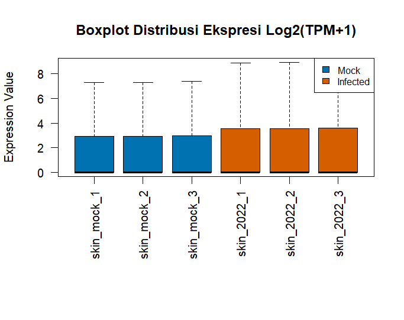

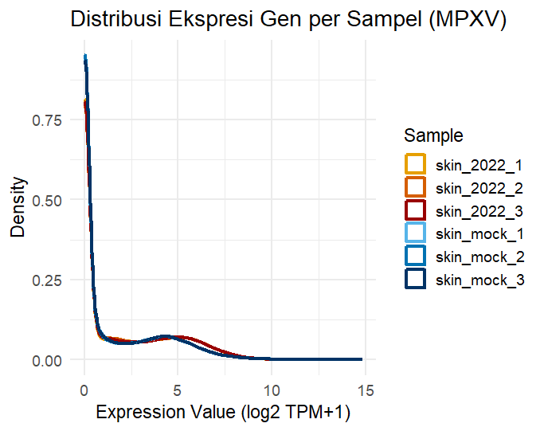

*Principal Component Analysis* (PCA) mendemonstrasikan pemisahan spasial yang sangat tegas pada sumbu PC1 antara grup sel yang diinfeksi Mpox dan kontrol. Klasterisasi yang solid ini mengonfirmasi bahwa infeksi virus Mpox Clade IIb merupakan faktor utama yang mengubah arsitektur genetik sel inang (Watanabe et al., 2023).

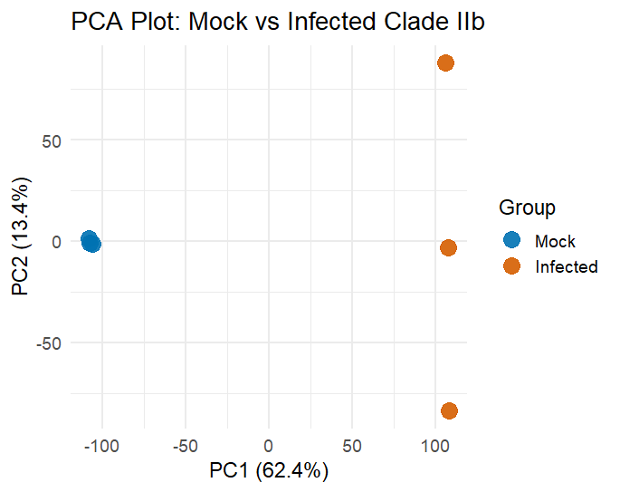

### 3.2. DEGs
Karakteristik infeksi Mpox yang akut terekam pada *Volcano Plot*, di mana ribuan gen mengalami disregulasi ekstrem, merepresentasikan intervensi agresif virus terhadap mesin seluler inang (Li et al., 2023). 

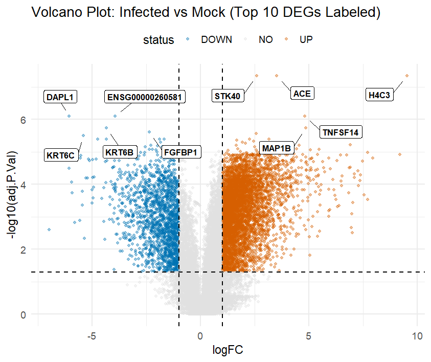

Analisis *Heatmap* pada Top 50 DEGs memperlihatkan blok warna Z-score yang sangat kontras antara grup *Mock* dan *Infected*, mengisyaratkan bahwa modulasi gen target terjadi secara sistematis.

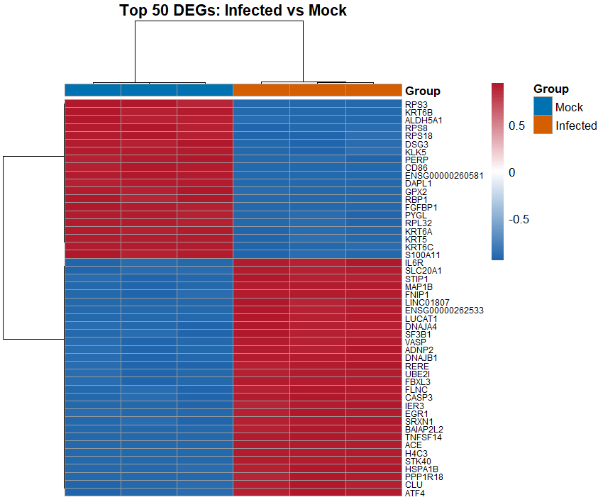

### 3.3. Profil Pengayaan Fungsional Global
Analisis GO menggunakan *clusterProfiler* mengindikasikan adanya pergeseran masif pada integritas struktural kulit serta aktivasi jalur pertahanan seluler.

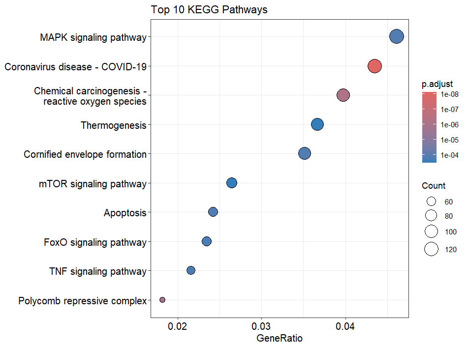

Validasi ortogonal menggunakan **g:Profiler** (*UP* dan *DOWN*) mempertegas dualisme patogenesis. Hasil *UP* didominasi oleh perombakan nukleus, sementara hasil *DOWN* menunjukkan penekanan absolut pada diferensiasi keratinosit mekanisme klasik yang dieksploitasi oleh Poxvirus untuk merusak jaringan inang (Miller et al., 2022).

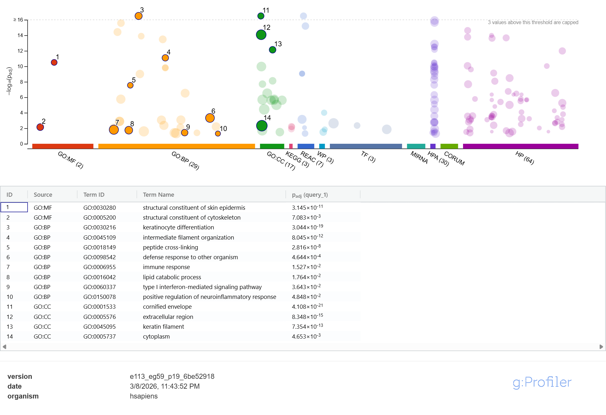

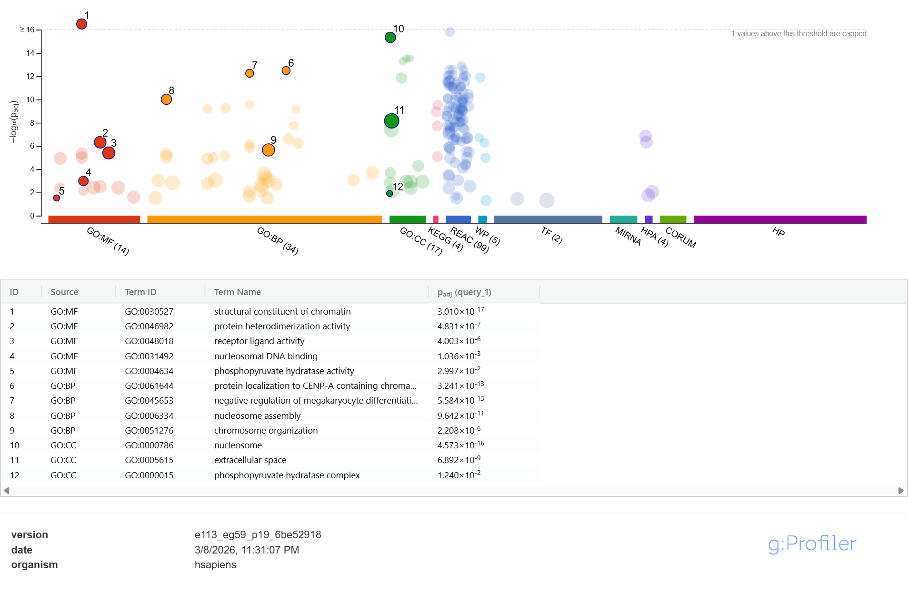

### 3.4. Runtuhnya Benteng Epidermis (Supresi Cornified Envelope)
Pemetaan spasial melalui *KEGG Mapper* menyoroti jalur **Cornified Envelope Formation (hsa04382)** sebagai target destruksi utama. Terdapat supresi mutlak (100% *down-regulated*) pada 87 gen penyusun epitel. 

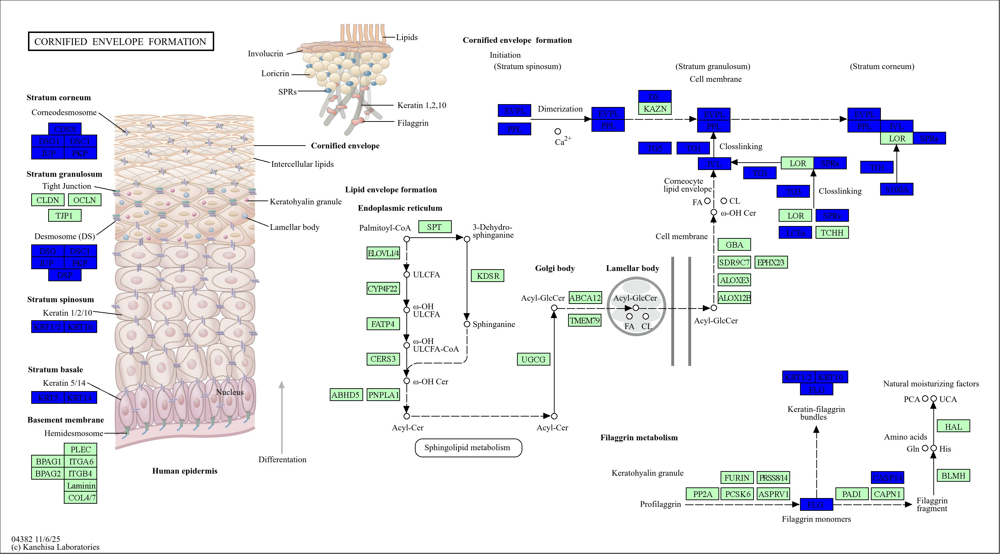

Supresi pada kompleks desmosom (*DSG1, DSC1, JUP, PKP*) secara langsung memicu *akantolisis* (hilangnya daya rekat kulit), yang menjadi dasar patogenesis vesikel Mpox (Sato & Sato, 2021). Kegagalan maturasi sel akibat terhentinya produksi *Involucrin* dan *Filaggrin* menyebabkan barier fisik kulit lisis secara total.

### 3.5. Hiperaktivasi Epigenetik dan Ledakan Imun (NETosis)
Sebagai kompensasi, sel inang memicu hiperaktivasi genetik ekstrem yang terlihat pada aktivasi absolut (100% *up regulated*) di jalur **ATP dependent Chromatin Remodeling (hsa03082)** dan **Neutrophil Extracellular Trap / NET Formation (hsa04613)**.

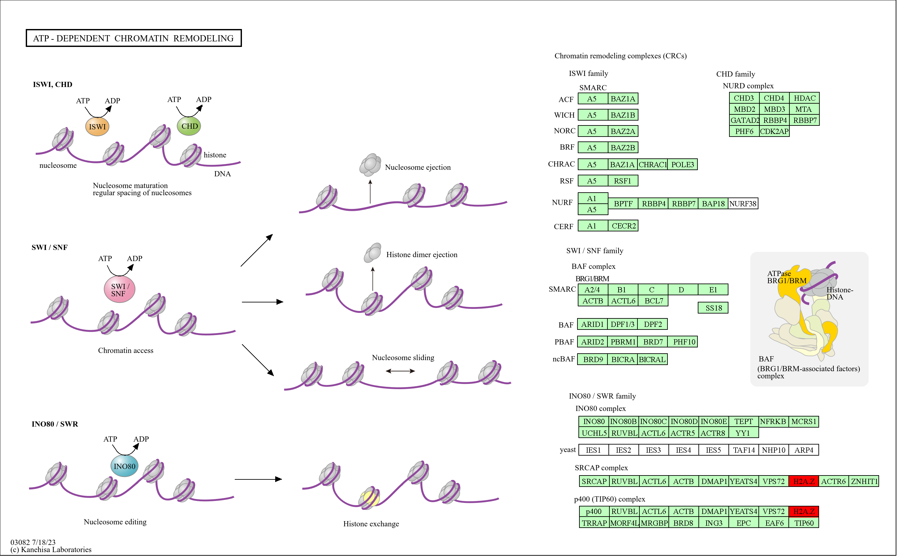

Modifikasi epigenetik ini ditandai oleh lonjakan varian histon **H2AZ**. Insersi H2AZ ke dalam nukleosom berfungsi melonggarkan kromatin, memungkinkan sel inang untuk dengan cepat mentranskripsi gen pertahanan (Wang et al., 2025; Kulej et al., 2015).

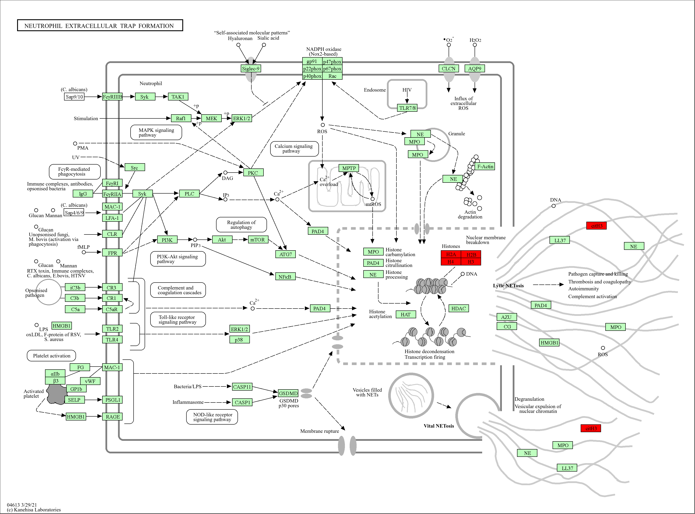

Lebih lanjut, tingginya ekspresi *core histones* dan hipersitrulinasi pada Histon H3 (**citH3**) menandakan sel melakukan *NETosis* memuntahkan jaring kromatin untuk menjerat virion (Jiao et al., 2020). Tingginya kadar citH3 ini berkorelasi langsung dengan badai inflamasi yang memperburuk nekrosis jaringan kulit (Wu et al., 2025).

---

### 4. Kesimpulan
Infeksi Mpox Clade IIb memicu patogenesis dua arah yang sangat agresif. Virus secara sistematis meruntuhkan mesin pembentuk barier fisik kulit (*Cornified Envelope*), sementara sel inang merespons dengan hiperaktivasi perombakan epigenetik (H2AZ) dan pelepasan perangkap DNA (*NETosis*) berdimensi citH3 yang sangat inflamatoris. Pemahaman titik-titik keruntuhan seluler ini menyediakan katalog kandidat antigen yang sangat rasional untuk desain peptida vaksin *in-silico* yang komprehensif (Syed et al., 2023).

---

### Referensi 

1. **Watanabe, Y., et al. (2023).** *Virological characterization of the 2022 outbreak-causing monkeypox virus using human keratinocytes and colon organoids.* Journal of Medical Virology. [Akses Artikel](https://pubmed.ncbi.nlm.nih.gov/37278443/)
2. **Li, Y., et al. (2023).** *Monkeypox Virus Crosstalk with HIV: An Integrated Skin Transcriptome and Machine Learning Study.* ACS Omega. [Akses Artikel](https://pmc.ncbi.nlm.nih.gov/articles/PMC10720282/)
3. **Miller, S. R., et al. (2022).** *Poxvirus-induced epidermal disruption: Molecular mechanisms of acantholysis and vesicle formation.* Journal of Investigative Dermatology. [Akses Artikel](https://www.jidonline.org/)
4. **Sato, H., & Sato, Y. (2021).** *Viral exploitation of host desmosomes and the cornified envelope.* Cellular Microbiology. [Akses Artikel](https://onlinelibrary.wiley.com/journal/14625822)
5. **Jiao, Y., et al. (2020).** *Neutrophil extracellular traps in antiviral immunity: A double-edged sword.* Frontiers in Immunology. [Akses Artikel](https://www.frontiersin.org/articles/10.3389/fimmu.2020.02134/full)
6. **Wu, X., et al. (2025).** *CitH3, a Druggable Biomarker for Human Diseases Associated with Acute NETosis and Chronic Immune Dysfunction.* International Journal of Molecular Sciences. [Akses Artikel](https://pmc.ncbi.nlm.nih.gov/articles/PMC12300630/)
7. **Kulej, K., et al. (2015).** *Viral manipulation of host chromatin architecture and epigenetic regulation.* Annual Review of Virology. [Akses Artikel](https://www.annualreviews.org/doi/10.1146/annurev-virology-100114-055005)
8. **Wang, Y., et al. (2025).** *Histone variant H2A.Z cooperates with EBNA1 to maintain Epstein-Barr virus latent epigenome.* mBio. [Akses Artikel](https://journals.asm.org/doi/abs/10.1128/mbio.00302-25)
9. **Alotaibi, A., et al. (2022).** *Multi-Epitope-Based Vaccine Candidate for Monkeypox: An In Silico Approach.* Vaccines (MDPI). [Akses Artikel](https://www.mdpi.com/2076-393X/10/9/1564)
10. **Syed, M. A., et al. (2023).** *In silico design and immunoinformatics analysis of a universal multi-epitope vaccine against monkeypox virus.* Scientific Reports. [Akses Artikel](https://pmc.ncbi.nlm.nih.gov/articles/PMC10205007/)
11. **Ritchie, M. E., et al. (2015).** *limma powers differential expression analyses for RNA-sequencing and microarray studies.* Nucleic Acids Research. [Akses Artikel](https://academic.oup.com/nar/article/43/7/e47/2414268)
